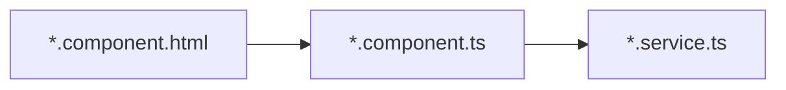

<div class="absolute bottom-10">
  <h1>Artemis</h1>
  <p>Onboarding 2023</p>
</div>

---

# Outline

- **Client** - libraries and technologies we use, internal dataflow
- **Server** - architecture technologies and how to use them
- **Scenario: Creating a text exercise** - apply what we learned
- **Tips and tricks** - save time and work more efficient

---
layout: section
---

# Client

---

# Client

## Things we use and save us time

- [Typescript](https://www.typescriptlang.org/) - really use types if applicable
- [Bootstrap](https://getbootstrap.com/) - use predefined styles if you're unsure
- [jest](https://jestjs.io/) - testing framework

## Things we use

- [Angular](https://angular.io/docs) - read the docs about components and servies
- [ngBootstrap](https://ng-bootstrap.github.io/#/home) - component library built on bootstraps
  <span class="text-gray-500 italic">look here for bugs</span>🐞
- [ngx-charts](https://swimlane.gitbook.io/ngx-charts/) - chart library
  <span class="text-gray-500 italic">look here for frustration</span>

---

# Client

## Data flow



- user clicks on `start exercise` button
- in `exercise-details-student-actions.component.html`: event is registered and sent to
- `exercise-details-student-actions.component.ts`: additional logic e.g. checks, sends request to
- `exercise.service.ts`, where rest call to server happens
- Rest call resolves and data is propagated back to `html`, where view changes

---
layout: section
---

# Server

---
layout: image-right
image: 'assets/ServerArchitecture.png'
---

# Server

## Architecture

- Client accesses REST endpoints in web layer
- Web layer passes request to application layer, where more complicated logic happens
- Application layer uses data layer (database) and other systems to enable its functionality

---

# Server

## JPA, hibernate

JPA and hibernate enable a mapping between our classes and our databases.

```java
@Entity
@Table(name = "feedback")
@Cache(usage = CacheConcurrencyStrategy.NONSTRICT_READ_WRITE)
@JsonInclude(JsonInclude.Include.NON_EMPTY)
public class Feedback extends DomainObject {
  ...
}
```

- By adding annotations we generate the tables, columns, etc to save our objects.
- Just add the annotations and the next time you start the server the database changes happen

---

# Server

## Liquibase

### Why?
- prevent irreversible database modifications
- prepare databse changes that can be reviewed

### Gradle commands
- **liquibaseClearChecksums**: Artemis server does not start with ...liquibase error
- **liquibaseDiffChangeLog**: Generate a new changelog

Changelogs are loaded from `src/main/resources/config/liquibase/master.xml`

---

# Server

## SQL queries

### Writing actual SQL

```java
    @Query("""
            SELECT e
            FROM Exercise e
                LEFT JOIN FETCH e.categories
            WHERE e.course.id = :courseId
            """)
    Set<Exercise> findByCourseIdWithCategories(@Param("courseId") Long courseId);
```

### [Data derived queries](https://www.baeldung.com/spring-data-derived-queries)

```java
    Optional<TemplateProgrammingExerciseParticipation>
    findWithEagerResultsAndSubmissionsByProgrammingExerciseId(Long exerciseId);
```

---
layout: section
---

# Scenario: Creating a text exercise

---
layout: section
---

# Tips

---

# Tips - tools

## Browser
- Console
- Sources
- Network
- [Angular DevTools extension](https://chrome.google.com/webstore/detail/angular-devtools/ienfalfjdbdpebioblfackkekamfmbnh)

## IntelliJ Idea
- Database
- Endpoints
- Pull requests
- Find usages, references, implementation

---

# Tips - client

## Guidelines

- [Angular components](https://angular.io/guide/component-overview)
- [Angular services](https://angular.io/guide/architecture-services)
- [Angular dependency injection](https://angular.io/guide/dependency-injection)
- [Client theming](https://docs.artemis.cit.tum.de/dev/guidelines/client-design/) - describes colors only
- [Artemis client guidelines](https://docs.artemis.cit.tum.de/dev/guidelines/client/)

## Thing you shouldn't do

- Components do too much; too little use of services
- Lack of abstraction - a lot of duplicated code
- [Prop drilling](https://blog.logrocket.com/solving-prop-drilling-react-apps/) - again because we don't use services

---

# Tips - server

- Also add permission checks here
