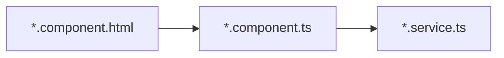
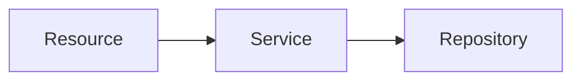

<div class="absolute bottom-10">
  <h1>Artemis</h1>
  <p>Onboarding 2023</p>
</div>

---

# Outline

- **Client** - libraries and technologies we use, internal dataflow
- **Server** - architecture technologies and how to use them
- **Scenario: Creating a text exercise** - apply what we learned
- **Tips and tricks** - save time and work more efficient

---
layout: section
---

# Client

---

# Client

## Things we use and save us time

- [Typescript](https://www.typescriptlang.org/) - really use types if applicable
- [Bootstrap](https://getbootstrap.com/) - use predefined styles if you're unsure
- [jest](https://jestjs.io/) - testing framework

## Things we use

- [Angular](https://angular.io/docs) - read the docs about components and services
- [ngBootstrap](https://ng-bootstrap.github.io/#/home) - component library built on bootstraps
  <span class="text-gray-500 italic">look here for bugs</span>🐞
- [ngx-charts](https://swimlane.gitbook.io/ngx-charts/) - chart library
  <span class="text-gray-500 italic">look here for frustration</span>

---

# Client

## Data flow



- user clicks on `start exercise` button
- in `exercise-details-student-actions.component.html`: event is registered and sent to
- `exercise-details-student-actions.component.ts`: additional logic e.g. checks, sends request to
- `exercise.service.ts`, where rest call to server happens
- Rest call resolves and data is propagated back to `html`, where view changes

---
layout: section
---

# Server

---
layout: image-right
image: 'assets/ServerArchitecture.png'
---

# Server

## Architecture


- Client accesses REST endpoints in web layer
- Web layer passes request to application layer, where more complicated logic happens
- Application layer uses data layer (database) and other systems to enable its functionality
- WebSockets for two-way communication

---

# Server

## Core libraries
- [Spring](https://spring.io/) - Dependency injection
- [Spring Boot](https://spring.io/projects/spring-boot) - Integrate libraries with Spring
- [Liquibase](https://www.liquibase.org/) - Database migrations

## Distributed system

- [Hazelcast](https://hazelcast.com/) - Distributed data structures
- [ActiveMQ Artemis](https://activemq.apache.org/components/artemis/) - WebSocket broker
- [JHipster Registry](https://www.jhipster.tech/jhipster-registry/) - Service discovery

--- 

# Server

## JPA, hibernate

JPA and hibernate enable a mapping between our classes and our databases.

```java
@Entity
@Table(name = "feedback")
@Cache(usage = CacheConcurrencyStrategy.NONSTRICT_READ_WRITE)
@JsonInclude(JsonInclude.Include.NON_EMPTY)
public class Feedback extends DomainObject {
  ...
}
```

- Annotations specify tables names, conditions (min/max length), etc.
- You have to add new columns etc to the database using `Liquibase`

---

# Server

## Liquibase

```xml
<addColumn tableName="exam">
    <column name="example_solution_publication_date" type="datetime">
        <constraints nullable="true"/>
    </column>
</addColumn>
```

### Why?
- Prevent irreversible database modifications
- Prepare database changes that can be reviewed

### Gradle commands
- **liquibaseClearChecksums**: Artemis server does not start with ...liquibase error
- **liquibaseDiffChangeLog**: Generate a new changelog

Changelogs are loaded from `src/main/resources/config/liquibase/master.xml`

[Artemis migration documentation](https://docs.artemis.cit.tum.de/dev/migration/)

---

# Server

## SQL queries
Used in repositories

### Writing actual SQL

```java
    @Query("""
            SELECT e
            FROM Exercise e
                LEFT JOIN FETCH e.categories
            WHERE e.course.id = :courseId
            """)
    Set<Exercise> findByCourseIdWithCategories(@Param("courseId") Long courseId);
```

### [Derived queries](https://www.baeldung.com/spring-data-derived-queries)

```java
    Optional<TemplateProgrammingExerciseParticipation>
    findWithEagerResultsAndSubmissionsByProgrammingExerciseId(Long exerciseId);
```


---

# Server

## External systems

### Programming exercises
- [Atlassian stack (Bitbucket, Bamboo)](https://docs.artemis.cit.tum.de/dev/setup/#bamboo-bitbucket-and-jira-setup)
- [Gitlab, Jenkins](https://docs.artemis.cit.tum.de/dev/setup/#jenkins-and-gitlab-setup)
- [Gitlab, Gitlab CI](https://docs.artemis.cit.tum.de/dev/setup/#gitlab-ci-and-gitlab-setup)

### User Management
- [Jira](https://docs.artemis.cit.tum.de/dev/setup/#bamboo-bitbucket-and-jira-setup)

### Text exercises
- [Athena](https://github.com/ls1intum/Athena)


We use [profiles](https://www.baeldung.com/spring-profiles) to select correct implementation at server start

```java
@Service
@Profile("bitbucket")
public class BitbucketService extends AbstractVersionControlService {
```

---
layout: section
---

# Scenario: Creating a text exercise

---
layout: section
---

# Tips

---

# Tips - tools

## Browser
- Console
- Sources
- Network
- [Angular DevTools extension](https://chrome.google.com/webstore/detail/angular-devtools/ienfalfjdbdpebioblfackkekamfmbnh)

## IntelliJ Idea
- Database
- Endpoints
- Pull requests
- Find usages, references, implementation

---

# Tips - client

## Guidelines

- [Angular components](https://angular.io/guide/component-overview)
- [Angular services](https://angular.io/guide/architecture-services)
- [Angular dependency injection](https://angular.io/guide/dependency-injection)
- [Client theming](https://docs.artemis.cit.tum.de/dev/guidelines/client-design/) - describes colors only
- [Artemis client guidelines](https://docs.artemis.cit.tum.de/dev/guidelines/client/)

## Things you shouldn't do

- Components do too much; too little use of services
- Lack of abstraction - a lot of duplicated code
- [Prop drilling](https://blog.logrocket.com/solving-prop-drilling-react-apps/) - again because we don't use services

---

# Tips - server

## Guidelines

- [Artemis server guidelines](https://docs.artemis.cit.tum.de/dev/guidelines/server/)
- [Artemis server testing](https://docs.artemis.cit.tum.de/dev/guidelines/server/#assert-using-the-most-specific-overload-method)
- [Permission checks](https://docs.artemis.cit.tum.de/dev/guidelines/server/#rest-endpoint-best-practices-for-authorization) - Both role and indiviual resource


## Things you shouldn't do

- Use normal Maps/List to store data - we run a distributed system
- Circular dependencies between services - you might have to extract logic
- SQL queries that load many related objects - they have to fit in memory

---

# Tips - testing changes

## Local environment

- Feel free to do whatever you want - you have to clean it up if you mess up
- [Setup guides for external systems](https://docs.artemis.cit.tum.de/dev/setup/#)


## Testing environments

- [Set of test servers with different external systems](https://confluence.ase.in.tum.de/pages/viewpage.action?pageId=25252245)
- Coordinate via Slack channel `#artemis-testserver`
- Get approval before deploying database changes - really messy to clean it up otherwise
- [Deployment via Bamboo](https://confluence.ase.in.tum.de/display/ArTEMiS/Deploying+changes+to+test+server)
- Reach out to responsible contact for config changes
